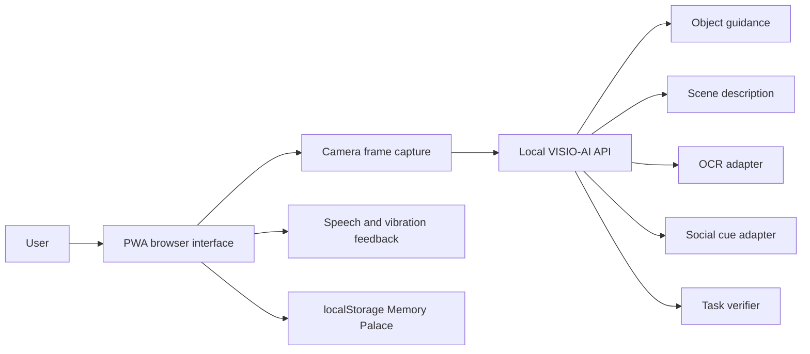

# VISIO-AI End-to-End Solution

## 1. Problem

Visually impaired users need assistance with object location, environmental understanding, text reading, social context, step-by-step task support, and remembering spatial landmarks. Existing tools are often audio-heavy, cloud-dependent, or locked into native apps and dedicated hardware.

## 2. Aim

VISIO-AI delivers the AIDEN and NETRA ideas as one browser-accessible application. The system prioritizes privacy, low-friction access, and multimodal feedback through speech, vibration, camera analysis, and persistent local landmarks.

## 3. Architecture

The solution uses a Progressive Web App frontend and a local Python backend:

- Frontend: HTML, CSS, JavaScript, camera capture, speech synthesis, speech recognition, vibration, localStorage, service worker.
- Backend: local HTTP API, WebSocket live guidance, in-memory frame analysis, target-aware local vision, guidance mapping, scene heuristics, OCR/social/task adapter points.
- Storage: no image storage; only Memory Palace entries are stored locally in the browser.

## 4. Modules

### Find an Object

The user enters or speaks a target object. The browser captures a frame and sends it to the local API. The backend normalizes the requested object into supported families such as door, handle, cup, bottle, phone, laptop, text/label, and person. It then searches for target-specific visual evidence, computes distance from the frame center, and maps the result to AIDEN-style pulse categories:

- `slow`: distance greater than 0.4
- `medium`: distance between 0.2 and 0.4
- `rapid`: distance below 0.2
- `locked`: distance below 0.05

The browser plays speech guidance and calls the Vibration API when available.

The module also includes a WebSocket live guide that streams frames once per second in the local demo build. In a production build, increase this rate toward the proposal's 10 to 15 FPS target after connecting YOLOv8 or another real-time detector.

### Scene Description

The backend summarizes lighting, visual detail, dominant color, and the strongest visual region. In production, this endpoint should be connected to LLaVA, Gemini, or another visual-language model.

### OCR

The OCR module provides a working interface and text-to-speech. In browsers with the native TextDetector API, VISIO-AI recognizes and speaks detected words directly. The backend also detects and centers likely text/label regions, and the manual text fallback keeps the workflow usable on browsers without native OCR. Production adapters can use Tesseract, EasyOCR, PaddleOCR, or a VLM.

### Social Intent

The social module avoids biometric identification. It detects possible person/face regions using local visual cues, returns consent-aware guidance, warns when lighting is poor, and can be upgraded with a VLM prompt for expressions, gestures, and social context.

### Agentic Task Guidance

The guide module maintains task state in the browser and verifies each step from a live frame. Step verification is target-aware, so door, handle, cup, bottle/kettle, and label/text steps check for the relevant visual evidence before allowing the user to continue. Three task flows are included: making tea, approaching a door, and reading a label.

### Memory Palace

The Memory Palace stores named landmarks and notes in browser localStorage. It persists between sessions without sending private spatial information to a server.

## 5. Accessibility

- High contrast text and clear focus outlines
- Keyboard-accessible controls
- Screen-reader-friendly labels and live regions
- Speech output for results
- Optional voice input for object targets
- Large touch targets
- Responsive layout for mobile and desktop

## 6. Privacy and Security

- No frame is written to disk.
- API analysis is local by default.
- No third-party model request is made by the demo build.
- The response headers restrict camera and microphone permissions to the same origin.
- Memory Palace data remains in the user's browser.

## 7. Evaluation Plan

Use AIDEN's TAM-oriented evaluation pattern:

- Participants: 5 to 10 visually impaired users for pilot testing.
- Metrics: task completion, response latency, perceived usefulness, perceived ease of use, attitude toward using, behavioral intention.
- Baselines: object guidance target below 1 second in a local network setting, scene description within 12 to 15 seconds when a real VLM adapter is connected.
- Qualitative prompts: confidence, cognitive load, audio overload, comfort with privacy, and perceived independence.

## 8. How to Upgrade to Full AI Models

The project is structured so real model calls replace the current demo heuristics without redesigning the UI:

1. Install the selected object detector and expose a function returning bounding boxes.
2. Replace or extend `detect_target_box()` inside `visio_ai_server.py` with the detector result for the requested target.
3. Replace `describe_scene()` with a VLM call.
4. Replace `ocr_result()` with Tesseract, EasyOCR, PaddleOCR, or VLM transcription.
5. Replace `social_result()` with a consent-aware social-intent prompt.
6. Keep `guidance_from_box()` unchanged so haptic mapping remains stable.

## 9. Deliverables

- Runnable local web app
- PWA manifest and offline shell
- Privacy-first local backend
- Six required modules
- Unit tests for haptic guidance mapping
- Project documentation and evaluation plan
